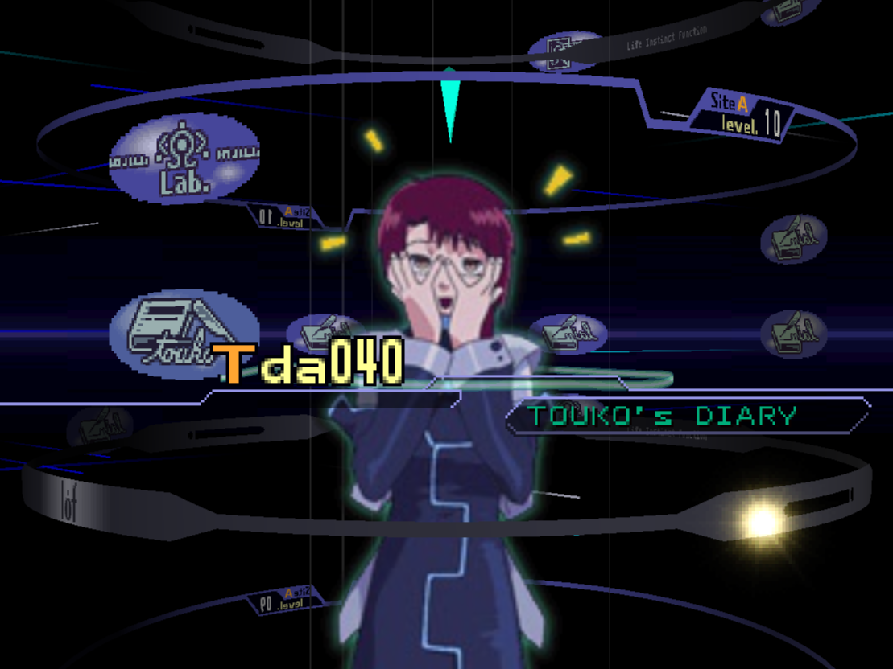
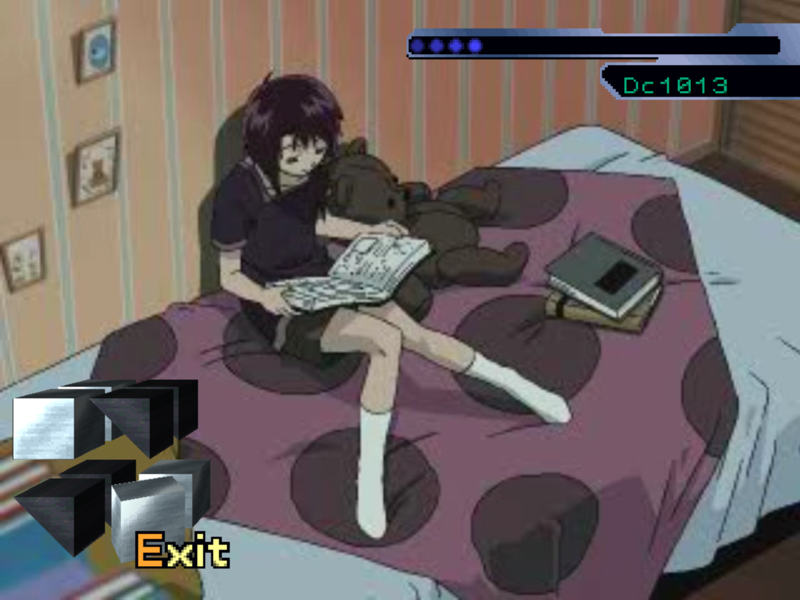
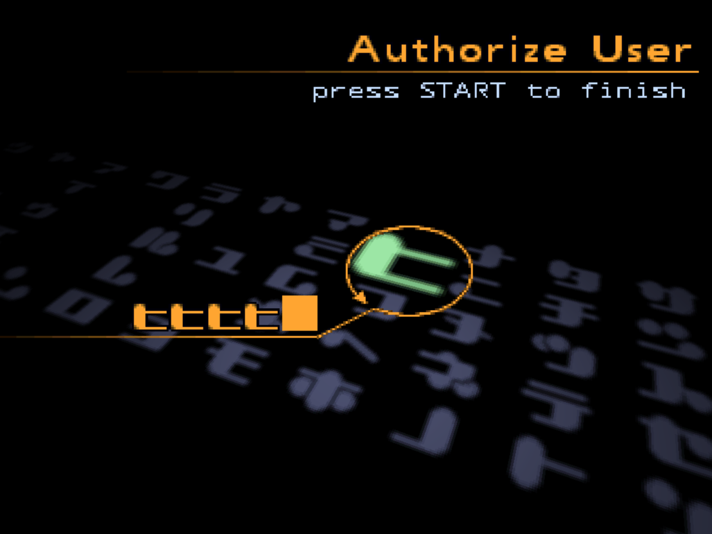
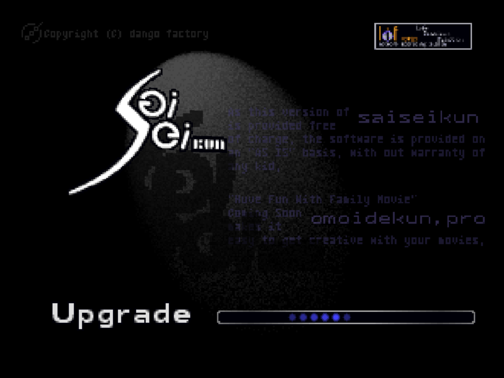
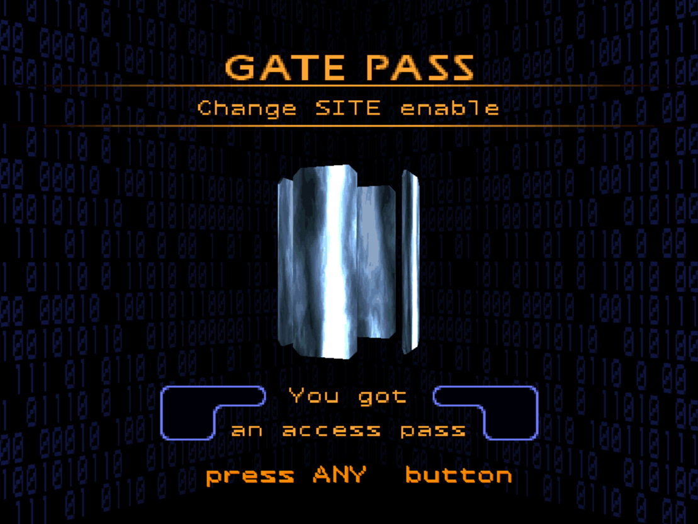
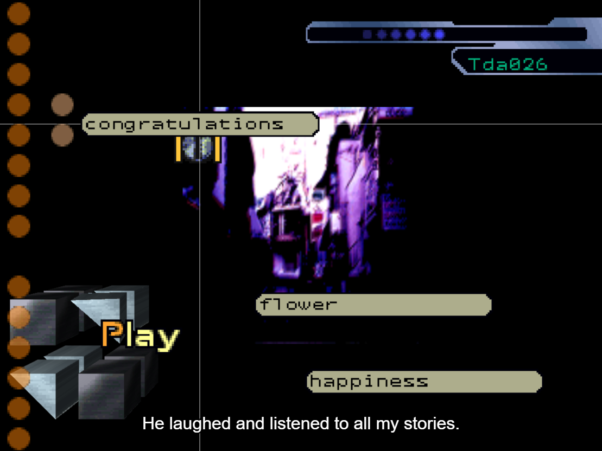
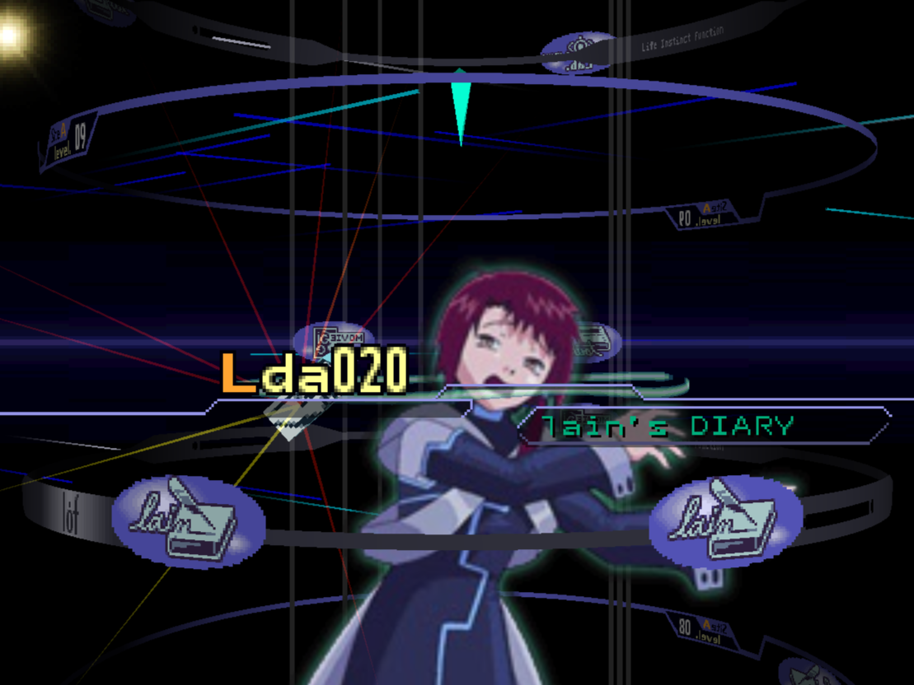

## lainTSX

A browser-based implementation of the Serial Experiments Lain PSX game using `three.js` with the aim to provide multi-language support and make it more accessible.

## History

The original PSX game was released in Japan, back in 1998. The game never got a proper english adaptation, which resulted in all non-Japanese speaking players either having to play through the game while simultaneously reading through the translation, or simply not playing the game at all and only reading it.

The goal of this project is to provide a better experience for those willing to play the game, and the way to do so is by implementing a subtitle system, which has the capability to support multiple languages.

## How do I contribute to the translations?
Go to https://crowdin.com/project/lain-psx

## Building locally

Since the repository doesn't host any of the game's assets, you need to provide the original binaries yourself.
By using a script we extract and format the assets necessary from the provided binaries.

Dependencies for running the script:
- Java
- FFmpeg
- ImageMagick >= 7

Instructions for running the script:
1. Inside the `scripts` folder, create `discs` folder, and put both disc binaries there under the names `disc1.bin` and `disc2.bin`.
2. Run `extract.mjs`. It also has potential flags you may want to use such as `--no-delete` and `--tempdir`.

Note that currently the extraction script doesn't extract SFX, but the game still runs fine locally.

## TODO

- **Finish writing the extraction script**
- **Improve/complete the translation**

## Screenshots

  
  
  
  
  
  
  
  

## Reporting bugs and contributing

If you have any ideas/suggestions/found an issue or want to help us with the translation or anything else, please [make an issue](https://github.com/ad044/lainTSX/issues).

## Tools used during development

- [`jPSXdec`](https://github.com/m35/jpsxdec) - PlayStation 1 audio/video converter.
- [`three.js`](https://github.com/mrdoob/three.js/) - JavaScript 3D renderer.